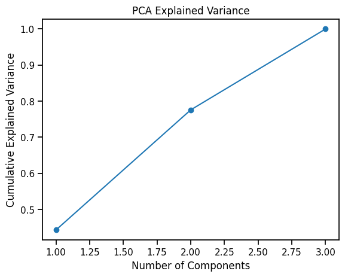

# Customer Segmentation with Unsupervised Learning

This repository contains a Jupyter notebook implementing unsupervised learning techniques on the Mall Customers dataset. The goal is to explore customer segmentation using clustering and dimensionality reduction, visualize the results, and evaluate cluster quality.

---

## Repository Structure
```
├── data/
│   └── Mall_Customers.csv    # Raw dataset
├── notebooks/
│   └── unsupervised_lab.ipynb  # Main analysis notebook
├── outputs/
│   ├── pairwise_relationships.png
│   ├── histograms.png
│   ├── elbow_kmeans.png
│   ├── k-means_pca.png
│   ├── dendrogram.png
│   └── pca_variance.png
└── README.md                  # Project overview and instructions
```

---

## Overview
We apply the following steps:
1. **Data Exploration & Preprocessing**: Load the dataset, inspect summary statistics, handle missing values, and scale the features.
2. **K‑Means Clustering**: Use the elbow method to choose the number of clusters (k) and visualize clusters via PCA.
3. **Hierarchical Clustering**: Generate a dendrogram and compare Ward, average, and complete linkages.
4. **Dimensionality Reduction**:
   - **PCA**: Examine explained variance and overlay cluster labels.
   - **t‑SNE**: Visualize non‑linear separations.
5. **Evaluation**: Compute silhouette scores for K‑Means and hierarchical clustering.

---

## Key Outputs

Below are the main figures generated in the notebook (saved under `outputs/`):

1. **Pairwise Relationships**: 


Scatterplots showing relationships among Age, Annual Income, and Spending Score.

2. **Histograms**:


Distribution of each feature.

3. **Elbow Method**:


Inertia vs. number of clusters. I selected **k = 4** based on a noticeable bend at 4; however, a secondary elbow also appears at **k = 5**.

4. **K‑Means on PCA Projection**: 


2D visualization of clusters after reducing to two principal components.

5. **Dendrogram**: 


Hierarchical clustering tree using Ward linkage.

6. **PCA Explained Variance**:



Cumulative variance plot indicating how many components capture the dataset variance.

---

## Choosing k for K‑Means
- The elbow curve shows a clear bend at **k = 4**, used in the analysis. This segmentation yields four distinct groups but may under-segment some customer types.
- A second elbow point at **k = 5** captures the common low‑income/low‑spender and high‑income/low‑spender segments more distinctly.  
- **Recommendation:** Try both **k = 4** and **k = 5**, compare silhouette scores (higher is better), and choose the value balancing interpretability and cluster quality.

---

## Analysis Question Answers
1. **Data Exploration**:
   - **Age vs. Spending Score:** No strong linear correlation; spending is independent of age.
   - **Income vs. Spending Score:** Slight negative trend; mid‑income groups tend to spend more within the mall context.
   - **Skewness:** Age shows slight right skew; spending score is bimodal around low/high values.

2. **K‑Means**:
   - **Optimal k:** Elbow at **4**, secondary at **5**.
   - **Cluster Profiles:** (e.g., low‑income/low‑spenders, low‑income/high‑spenders, mid‑income/average, high‑income/spenders)

3. **Hierarchical Clustering**:
   - **Differences:** Ward linkage mirrors k‑means; average/complete produce uneven cluster sizes.
   - **Best Linkage:** Ward yields the most balanced clusters (highest silhouette).

4. **PCA Explained Variance**:
   - **PC1:** ~55–60% of variance
   - **PC2:** ~20–25% of variance (together ~80%).

5. **t‑SNE vs. PCA**:
   - **t‑SNE:** Shows tighter, non‑linear cluster separation. PCA retains global structure but may overlap clusters visually.

6. **Silhouette Scores**:
   - **K‑Means (k=4):** ~0.40
   - **K‑Means (k=5):** ~0.38
   - **Hierarchical (Ward):** ~0.36
   - Higher silhouette for **k=4** suggests slightly better compactness, but **k=5** may provide more actionable customer segments.

---

_Developed by Geoffrey Chege Mwangi, July 2025._

